# FitMind

一个数据驱动的个人健身 / 饮食决策智能体：**对话式教练 + 3D 肌群恢复视图 + 训练计划闭环**。


它不是"把问题转发给大模型"的壳子——动作、营养、训练科学、运动医学四类知识都先落成可审计的  
本地数据集，再由 `lib/` 消费层和检索层供 Agent 使用；大模型只负责**理解你说的话**和**组织措辞**，  
数字一律来自查库求和。

```
你：我今天练了胸，明天能练背吗
Agent：（查图谱里 28 块肌群的恢复状态）胸大肌还在恢复窗口内，背阔肌已恢复——
      明天练背没问题。给你排了 4 个动作，第一个是高位下拉。

你：[拍一张午餐照片]
Agent：识别到「番茄炒蛋盖饭」，约 480 克 → 热量 612 kcal / 蛋白 22 g / 脂肪 21 g / 碳水 78 g

你：我有肩周炎，还能推举吗
Agent：（命中运动医学禁忌表）急性期不建议过顶推举。替代方案：……
```

---

## 目录

- [界面](#界面)
- [核心能力](#核心能力)
- [架构](#架构)
- [编排流程](#编排流程)
- [快速开始](#快速开始)
- [检索质量评估](#检索质量评估)
- [更新日志](#更新日志)
- [HTTP 接口](#http-接口)
- [目录结构](#目录结构)
- [数据资产与许可](#数据资产与许可)
- [几条设计取向](#几条设计取向)
- [已知限制](#已知限制)

---


## 界面

**主界面** —— 28 块肌群按恢复度着色（冷 = 恢复好，暖 = 需休息）；左上切换视图与显示开关，  
左下是恢复度图例，右侧是常驻的对话面板。

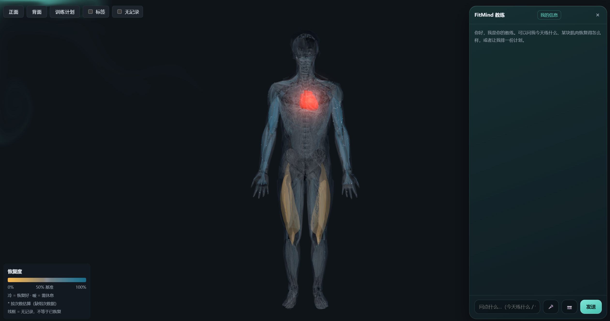

**打开标签** —— 每块肌群显示中文名与恢复百分比。措辞与数字全部由后端算好  
（`pct` / `describe`），前端只做呈现。

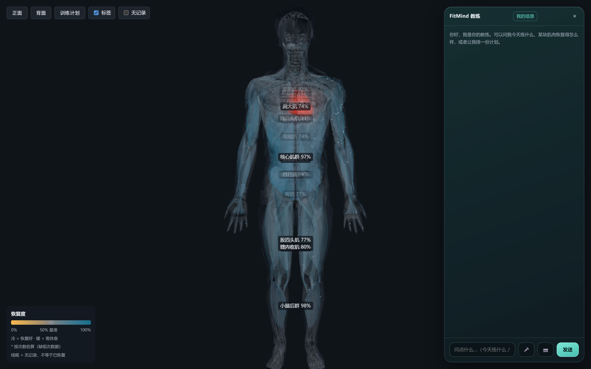

**对话** —— 问「我今天练了胸，明天能练背吗」，答案依据图谱里各肌群的真实恢复状态；  
动作卡带示例图、器械与难度中文名，卡片底部是媒体署名。

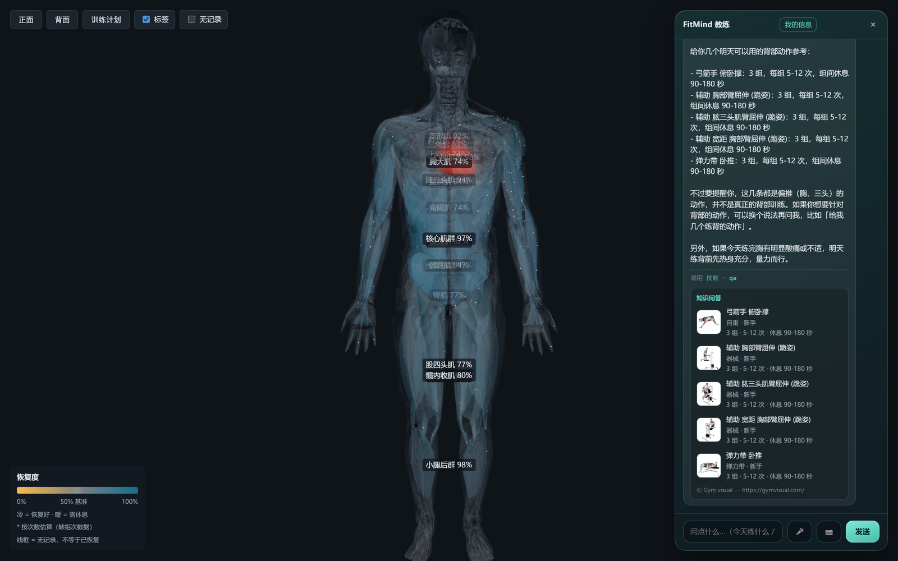

**训练计划** —— 周期化编排（分化循环 + 分期）：每天的动作、组次与组间休息，  
以及当日营养目标（热量与三大营养素）。

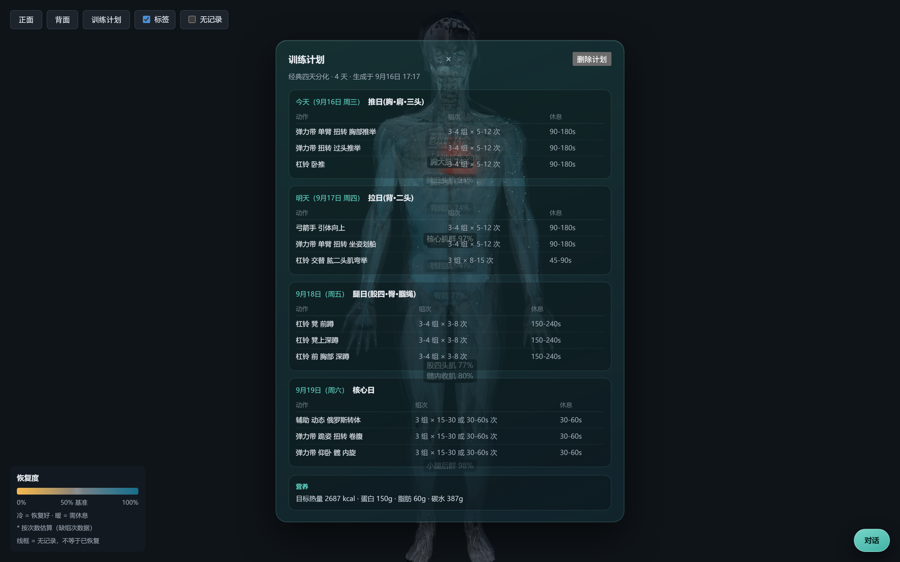

**跟练执行台** —— 从今天的计划直接开练：一屏只回答"现在做哪个动作、第几组、歇多久"。  
练完一组进组间歇、一个动作做完就写回一次图谱（3D 上的恢复度因此是真的）；  
跟练期间 3D 渲染随之挂起，不白烧电。

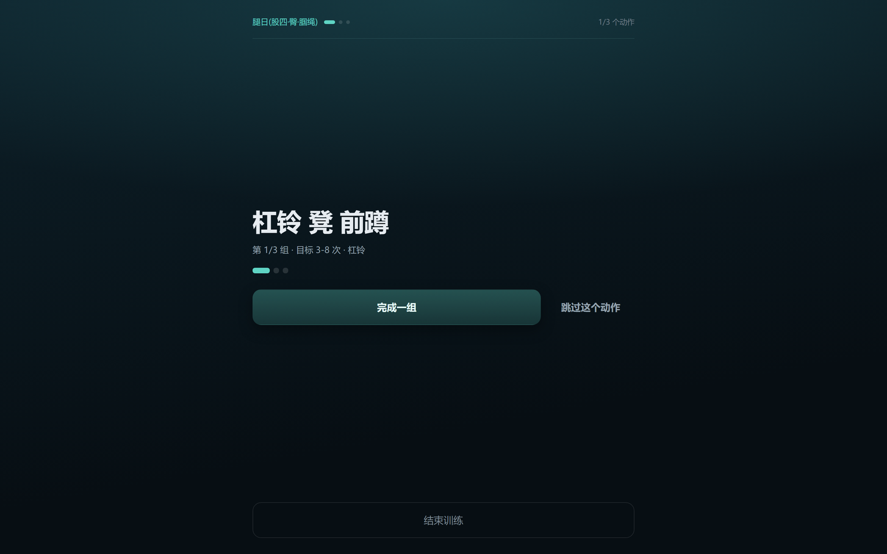

**组间歇** —— 倒计时环按剩余时间收缩；进度点阵（头部是动作、标题下是组）与  
"N/M"文字同源，瞥一眼就知道练到哪了。中途锁屏或误关页面，重开可以接着练。

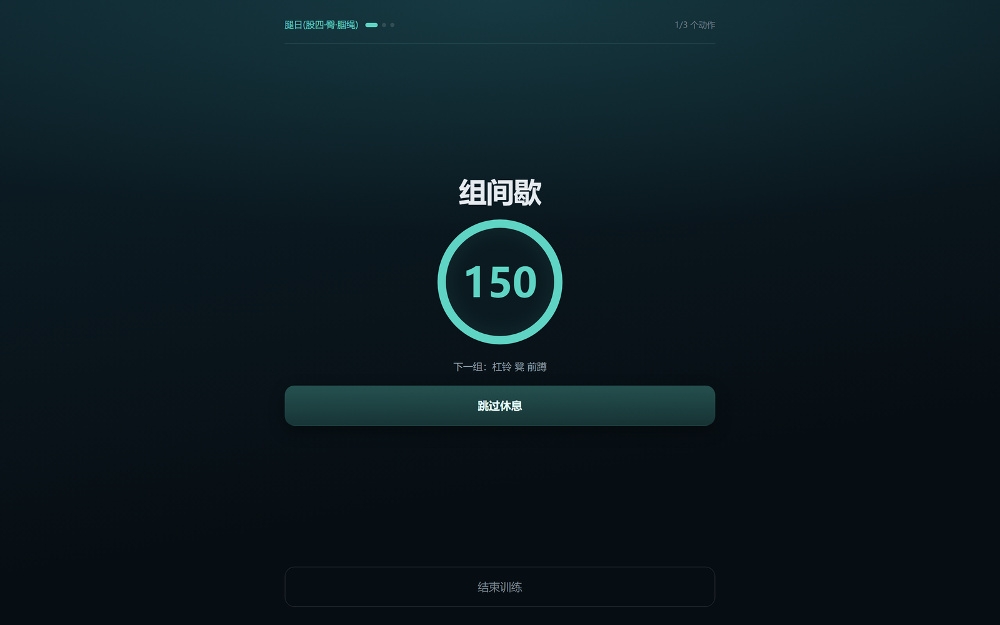

**曲库与跟练音乐** —— 本地音频文件导入 IndexedDB（刷新不丢），入库按「练时 / 间歇」  
分组，点徽标即时改组。跟练时按动作/间歇自动切歌，切换约 1s 交叉淡化；歇完切回练时组  
**续播**上次的位置。音频只留在本机，不上传、不出浏览器。

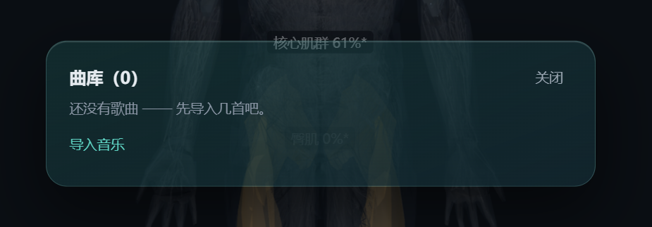

**背面视图** —— 与前面对称的另一套肌群，共享同一份恢复状态。

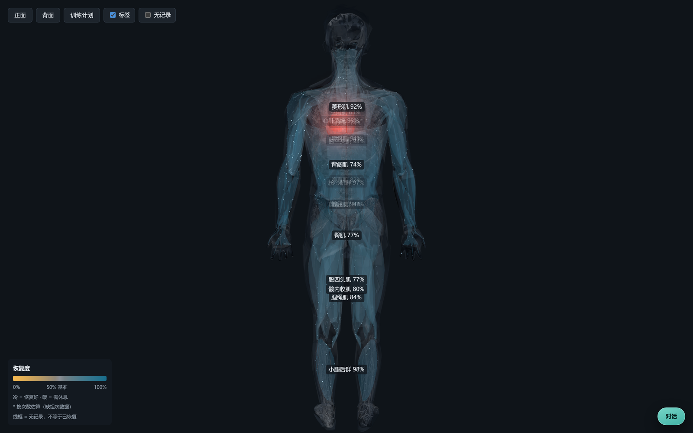

> 截图取自本地运行的实例（`/app/?user_id=<你的 id>`）。其中的训练记录、恢复度、计划与营养目标  
> 都是图谱里的**真实数据**，没有为了配图摆拍；`demo` 是一份 6 次训练的演示档案  
> （跟练两张用的是测试账号的当天计划）。  
> 想复现同样的视图，把记录写进去、用 `?user_id=<你的 id>` 打开即可。  
> 注意线框（无记录）与"已恢复"在界面上是两种不同的状态——这条区分是有意保留的。

---

## 核心能力

| 能力            | 说明                                                                        | 入口                                    |
| ------------- | ------------------------------------------------------------------------- | ------------------------------------- |
| **对话教练**      | 7 个技能经注册表路由，LangGraph 编排（Direct / ReAct / PlanExec / ReWOO 四种执行模式按问题动态切换） | `POST /v1/chat`、`/v1/chat/stream`     |
| **3D 肌群恢复视图** | 28 块肌群按恢复度着色；几何来自**真实解剖模型**（Z-Anatomy，CC BY-SA 4.0，见下方许可表）                | `http://<host>:8000/app/`             |
| **训练计划**      | 周期化编排（分化循环 + 分期），支持对话修改与整计划删除                                             | `GET /v1/plan`、`POST /v1/plan/delete` |
| **打卡与消歧**     | 记录训练；动作名歧义时出候选让用户点选，支持自定义输入                                               | `POST /v1/checkin/resolve`            |
| **食物拍照识别**    | VLM 只判"是什么 / 多少克"，营养数字由 `lib/dish_repo` 查库求和——**模型被禁止算热量**                | `POST /v1/vision/food`                |
| **语音输入**      | whisper 转写（可选依赖，见下文）                                                      | `POST /v1/asr`                        |
| **长期记忆**      | 双时态用户记忆图谱（Neo4j），偏好 / 伤病 / 目标可写入、可查询、可遗忘                                  | 随对话自动                                 |
| **伤痛 guard**  | 前置拦截高风险提问，查运动医学禁忌与回归赛场（RTP）阶梯，只做风险分级不做医学结论                                | 随对话自动                                 |

---


## 架构

依赖**单向**：`web` 经 HTTP 调 `app`，`app` 调 `lib`，`lib` 只读 `data`。

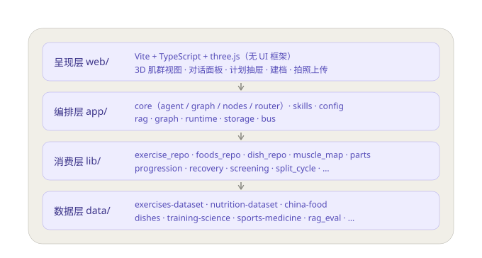

各层职责（清单按实际目录核对过）：

| 层              | 模块                           | 职责                                                                                                                                                                                                          |
| -------------- | ---------------------------- | ----------------------------------------------------------------------------------------------------------------------------------------------------------------------------------------------------------- |
| **呈现** `web/`  | Vite + TypeScript + three.js | 无 UI 框架；3D 肌群视图 · 对话面板 · 计划抽屉 · 建档 · 拍照上传。构建产物 `dist/` 由 `app/server.py` 挂在 `/app`                                                                                                                          |
| **编排** `app/`  | `core/agent.py`              | Agent 门面：会话、图外前置（记忆抽取 / 档案投影）、出图后组装结构化结果                                                                                                                                                                    |
|                | `core/graph.py`              | LangGraph `StateGraph` 装配 —— 连边见 [编排流程](#编排流程)                                                                                                                                                              |
|                | `core/nodes.py`              | 图节点（闭包工厂）+ 条件边路由                                                                                                                                                                                            |
|                | `core/router.py`             | 执行模式动态变换 + 意图语义层                                                                                                                                                                                            |
|                | `skills/`                    | `guard` / `qa` / `plan` / `teach` / `progress` / `smalltalk` / `preference`                                                                                                                                 |
|                | `config/`                    | 各链路的 JSON 配置：路由 / 意图例句 / LLM / 图谱 / ASR / 视觉                                                                                                                                                                |
|                | `rag/`                       | PG+pgvector 检索原语（调用方自行组合图与向量）+ cross-encoder rerank（可降级）                                                                                                                                                    |
|                | `graph/`                     | Neo4j 记忆图谱（双时态）+ 知识图谱                                                                                                                                                                                       |
|                | `runtime/`                   | asr / vision / pipeline / validator                                                                                                                                                                         |
|                | `storage/`                   | 私有 SQLite（gitignore，不入库）                                                                                                                                                                                    |
|                | `bus/`                       | MessageBus 多智能体契约（留位，未启用）                                                                                                                                                                                   |
| **消费** `lib/`  | 12 个模块                       | 纯只读、只依赖数据、无编排逻辑。4 个仓库（`exercise_repo` / `foods_repo` / `dish_repo` / `muscle_map`）+ `parts` / `progression` / `recovery` / `screening` / `split_cycle` / `serving_units` / `portion_reference` / `negation` |
| **数据** `data/` | 9 个数据集                       | `exercises-dataset` · `nutrition-dataset` · `china-food` · `dishes` · `training-science` · `sports-medicine` · `split-schemes` · `rag_eval` · `stress_v3`；各含 `data/`（成品）+ `scripts/`（幂等构建）+ `docs/`（数据字典）   |

### 外部依赖

| 服务                     | 用途                                    | 是否必需           |
| ---------------------- | ------------------------------------- | -------------- |
| DeepSeek API           | 意图分类 / 计划生成 / 措辞渲染 / 食物识别             | 必需             |
| PostgreSQL + pgvector  | RAG 向量库（schema `fitness`）             | 必需             |
| Neo4j 5                | 记忆图谱 + 知识图谱                           | 必需（不可用时相关能力降级） |
| Ollama + `bge-m3`      | 查询与语料的稠密向量（1024 维）                    | 必需             |
| `bge-reranker-base` 权重 | cross-encoder 重排，把 top-1 准确率从 80% 往上抬 | 可选，缺失自动降级      |
| whisper + torch        | `POST /v1/asr` 语音转写                   | 可选，~4.6 GB 显存  |

---

## 编排流程

下面三张图按 `app/core/graph.py` 的实际连边画。

**一次对话的完整链路** —— 注意记忆抽取与档案投影发生在图**之前**（图外前置），  
出图后才组装结构化结果并写会话留档：

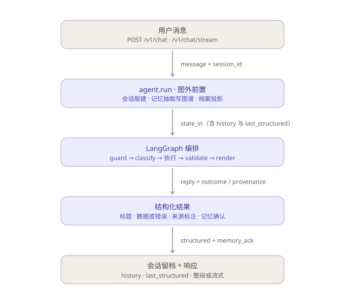

**图内的两个决策点** —— `guard` 与 `classify` 是仅有的会「提前收束」的地方：  
前者命中高风险提问就直接给安全提示（reply 在 guard 里写就），  
后者判不出意图、或打卡里的动作名有歧义时出反问 / 候选。  
两条短路都**不经过 render** —— 省掉一次措辞生成的 token：

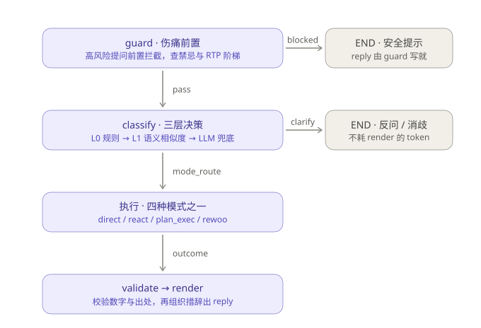

**四种执行模式的形状** —— 走哪一种由 `classify` 判出的复杂度决定，  
映射写在 `app/config/router_config.json`，是**数据驱动**的，不是散在代码里的分支：

| 复杂度     | 何时判为             | 模式          | 形状                                    |
| ------- | ---------------- | ----------- | ------------------------------------- |
| simple  | 默认兜底             | `direct`    | 单步执行                                  |
| medium  | progress / teach | `react`     | `think → act` 循环，直到不需要再调工具            |
| complex | plan             | `plan_exec` | `plan_node` → 逐步顺序执行 → `aggregate`    |
| batch   | 命中「请…一周…计划」      | `rewoo`     | `plan_node` → **4 槽并行** → `aggregate` |

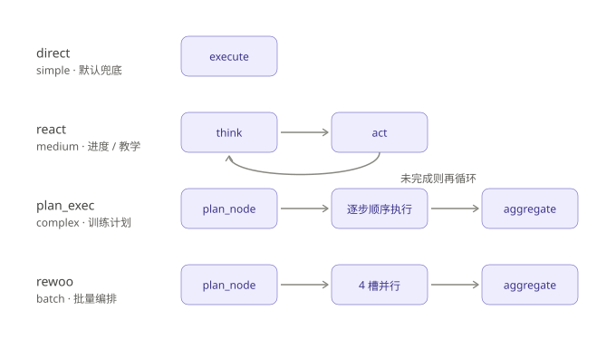

> 后两种模式**共用 `plan_node`**，分叉点在中间那一步：`plan_exec` 直接顺序跑完，  
> `rewoo` 才 fan-out 到 4 个 `execute_step{i}` 槽位再汇合——两条路最后都在 `aggregate`  
> 收口，再一并交给 `validate`。

---

## 快速开始

```bash
git clone https://github.com/roseplanetb613/FitMind.git
cd FitMind
```

### 0. 前置

- Python 3.12+（开发环境实测 3.14）
- Node 20+（仅前端）
- PostgreSQL 16 + [pgvector](https://github.com/pgvector/pgvector)
- [Ollama](https://ollama.com/)，并拉取嵌入模型：`ollama pull bge-m3`
- Docker（跑 Neo4j 用）

### 1. 装依赖

```bash
pip install -r app/requirements.txt
pip install "psycopg[binary]"        # ⚠ 见下方「已知限制」
cd web && npm install && cd ..
```

### 2. 配环境变量

```bash
cp .env.example .env
```

`.env` 已被 gitignore（**绝不入库**）。需要填：

| 变量                                       | 说明                                                    |
| ---------------------------------------- | ----------------------------------------------------- |
| `DEEPSEEK_API_KEY`                       | DeepSeek 密钥                                           |
| `NEO4J_PASSWORD`                         | Neo4j 密码，与 `docker-compose.yml` 联动                    |
| `DATABASE_URL`                           | 可选，缺省 `postgresql://postgres@127.0.0.1:5432/postgres` |
| `OLLAMA_BASE_URL` / `OLLAMA_EMBED_MODEL` | 可选，缺省 `http://127.0.0.1:11434` / `bge-m3`             |
| `RAG_RERANKER_DIR`                       | 可选，reranker 权重目录                                      |

### 3. 起服务

```bash
docker compose up -d          # Neo4j（数据落 D:\vm\docker\neo4j，持久化）
python -m app.rag.ingest      # 建向量库 + 知识图谱（幂等，可重跑）
cd web && npm run build       # 前端产物 → web/dist
python scripts/serve.py       # 后端 127.0.0.1:8000
```

打开 **`http://127.0.0.1:8000/app/`**。

> 注意是 `/app/` 不是 `/`——前端 `base` 与后端挂载点一致（`web/vite.config.ts`）。
>
> 日常验证走构建产物：`web/dist` 由 StaticFiles 按请求读盘，**重建后不用重启后端**，刷新即可。  
> `npm run dev`（Vite dev，`:5173`）只在需要热更新时用；它的 CSS 由 JS 注入，首帧有一个  
> "整页无样式"的窗口，**这是 dev 的固有行为，不是 bug**。

### 4. 验活

```bash
curl http://127.0.0.1:8000/health
curl "http://127.0.0.1:8000/v1/muscle-map?user_id=local"
```

---

## 检索质量评估

检索质量有一条独立的评估链：五格混淆（TP / WRONG / MISS / TN / LEAK），  
标注集在 [`data/rag_eval/queries.jsonl`](data/rag_eval/queries.jsonl)。

```bash
python scripts/eval_rag.py       # 需 Ollama 在线；不在线会 FAIL 而不是 skip（故意的）
```

核心看**证据准（evidence_precision）与错证率**，因为消费点是 `top_k=1`——  
挂了错证据比没证据更糟。脚本 docstring 里记着几轮实测结论（含被否决的方案  
与"修语料比调阈值有效"的根因），改检索前先读它。


### 判决层修复效果对比（v0.2.1）

改动：门槛 `0.55` 纯标量 → `0.60` + 分 `chunk_type` 词法旁证 + fail-closed  
（代码 `app/rag/policy.py`，决策记录  
[`docs/SDD/2026-09-20-vector-search-policy.md`](docs/SDD/2026-09-20-vector-search-policy.md)）。

⚠ 基线口径：**不能**拿 `eval_rag.py` 的 `dense` 行当"改前"——它会自己扫网格  
选阈值（在 test 上选出 0.624），既不是改前也不是改后。下表由  
`tmp/eval_before_after.py` 产出：固定用**线上真实门槛**跑两条路径，逐条对比。

| 子集                  |               | 证据准       | 错证率       | 召回    | WRONG | LEAK   | 该闭嘴时闭嘴    |
| ------------------- | ------------- | --------- | --------- | ----- | ----- | ------ | --------- |
| 全量 (test 104)       | 改前 @0.55      | 0.812     | 0.188     | 0.812 | 15    | **14** | 0.417     |
|                     | **改后** policy | **0.877** | **0.123** | 0.800 | **9** | **3**  | **0.875** |
| `exercise_cue` (60) | 改前 @0.55      | 0.875     | 0.125     | 0.875 | 7     | 4      | **0.000** |
|                     | **改后** policy | **1.000** | **0.000** | 0.857 | **0** | **0**  | **1.000** |
| `science_doc` (45)  | 改前 @0.55      | 0.593     | 0.407     | 0.593 | 11    | 7      | 0.611     |
|                     | **改后** policy | 0.577     | 0.423     | 0.556 | 11    | **3**  | **0.833** |

逐条翻转（全量）：`LEAK→TN ×11` · `WRONG→MISS ×6` · `TP→MISS ×1`  
⇒ **修好 17 条，弄坏 0 条**。

⚠ 三点别误读：

1. **`science_doc` 精度没改善**（0.593→0.577）。它的 LEAK 减少只来自门槛  
   0.55→0.60，不是判决层的功劳——该类内容散文 query 与正文无字面孪生关系，  
   所以**刻意不给它加旁证**。
2. **+17 条 ≠ 线上收益**：`LEAK→TN` 里 8 条落在 `science_doc`，而该类型  
   **生产上尚无消费点**（向量通道只挂在 `qa._rag_science`，线上 0 次触发）。  
   真正用户可达的约 9 条，且集中在 `exercise_cue`。
3. **`policy` 的 `exercise_cue` 分支目前仍无运行期消费者** —— 接线是独立的一波，  
   见 [`docs/superpowers/specs/2026-09-21-exercise-cue-wiring-design.md`](docs/superpowers/specs/2026-09-21-exercise-cue-wiring-design.md)。

### 图检索接通用户可见（v0.2.3）

> 完整说明见[更新日志](#2026-09-23--图检索接通用户可见)；本节只讲**检索侧**的设计理由。

此前**图检索的产出没有任何用户可见出口**：`teach_skill` 把同族替代写进
`it["rag_evidence"]`，而**全仓 0 个读取方**；`graph_*` 三个原语只吃**精确键**
（动作 id / 英文肌名），没有任何一条能从自然语言 query 进来。

本波补上三个缺口，并把它们接成一条链：

| 环节 | 落点 | 作用 |
|---|---|---|
| **入口** | `retriever.seed_exercise` | query 向量 → 种子动作 id（复用 `MIN_SCORE` 门槛，不新造阈值） |
| **组合** | `app/rag/fusion.py::compose` | 角色分离，**不融合分数**；产出固定形状 `facts` |
| **渲染** | `render_util.item_lines` | 认领 `rag_evidence` → 「可替代：…」「同肌群：…」「禁忌：…」 |

端到端实测（真 PG + 真 Neo4j）：

```bash
D:/dev/runtime/python/python.exe -c "
import sys; sys.path[:0]=['','lib','app']
from app.core.llm import load_dotenv; load_dotenv()
from app.skills.qa_skill import QaSkill
from app.skills.base import ExecutionContext
from app.core.session import Session
from app.core.render_util import item_lines
ex=ExecutionContext(session=Session(id='e2e'),profile={},mode='direct',skill_log=[])
r=QaSkill().execute(ex,{'query':'练胸的动作','kind':'exercise'})
print('\n'.join(item_lines(r.data)))"
```

输出（`练胸的动作`，首条挂了三键）：

```
· 弓箭手 俯卧撑
  同肌群：辅助 胸部臂屈伸 (跪姿)、杠铃 卧推、杠铃 下斜卧推、…
  禁忌：近期骨折（red）、肩周炎（yellow）、肩袖损伤（yellow）
```

⚠ **五点别误读**：

1. **这是「候选集 + 结构化事实」，不改 top-1。** `compose` **不动候选集、不动排序**
   —— 旧通道行为逐条不变由 `eval_rag.py --retriever all` 的四行数字不变来保证。
2. **为什么不融合分数**：实测 RRF 的 `hybrid` 行 准 0.67 / LEAK 21，**比单路都差**
   （融合分数对无关 query 也恒有值，没有"该弃权"的信息）。
3. **rerank 仍然不接线。** 探针 P3 实测 cross-encoder 在图扩展集上**净修 = 0**
   （修好 0 / 弄坏 0 / 不变 119），且该 0 是**结构性的**（种子恒不在自己的 `peers`
   里 ⇒ 正确答案不在被重排的候选集内）。`rank_ids` 保留实现与单测，**不得写成收益**。
4. **`graph` 评测行衡量不了本能力。** `eval_rag.py --retriever graph` 报的是
   "扩展集里有没有 expected"（实测 test `TP=1 WRONG=66`），枚举/替代这类能力
   本来就超出 top-1 表的口径 —— 它的用途是**可复算、可对比**，不是成绩。
5. **`peers` 的排序仍是确定但任意的**（6 条从 p50=150 里按 `alt.id` 截出）——
   已知缺口，挂到 Phase B。

实测出处：[`docs/SDD/2026-09-23-graph-channel-probe.md`](docs/SDD/2026-09-23-graph-channel-probe.md)
（探针 P1–P5）· 规格与计划：`docs/superpowers/specs\|plans/2026-09-23-graph-vector-hybrid-retrieval*.md`

#### 同一波修掉的严重度排序反向 bug

`GraphStore.contraindications` 的 `ORDER BY risk_level DESC` 在 Cypher 里是
**字符串比较**，码点序 `yellow > red > green` ⇒ `red`（暂停训练 / 建议就医）
被排到**最后**，再加 `LIMIT` 就是首丢。

**为什么原本全绿**：`FakeGraph` 是假 store，**根本不执行 Cypher**。
⇒ 教训：**逻辑写在 Cypher 里 ⇒ 单测看不见**。凡 Cypher 侧逻辑（排序 / 截断 / 过滤）
必须有「`GraphStore.__new__` + 注入假 driver 直接测真方法」或等价护栏。

修法：严重度序统一到 `lib/screening.RISK_ORDER` + `sort_by_risk`
（**全仓唯一**来源，`plan_check` 与图禁忌共用），Cypher 里不再有字符串序。
护栏用例同时钉住「返回序」与「Cypher 里不得再有字符串序」，**已证可证伪**。

### 数据安全修复：向量重建不再可能清空（v0.2.2）

**问题**：`ingest.build()` 先 `store.clear_all()`（`TRUNCATE fitness.embeddings`）  
再重建，两步**不在同一事务**，而重建整段包在 `except Exception: return False` 里  
（刻意的降级设计）⇒ **清空成功 + 重建失败 = 向量表永久为空，且不抛错**。  
触发条件很现实：`OllamaEmbedder.healthy()` 的 timeout 只有 3 秒，而 Ollama 在  
WSL 里、端口转发偶发抖动。实测已复现（预置 5 行 → 清空 → 生成失败 → **0 行**）。

**修法**：把清空**移交**重建函数并放进**同一个事务**，顺序改为  
「**先备好、再切换**」：

| 阶段     | 失败后果                                   |
| ------ | -------------------------------------- |
| 生成向量失败 | `TRUNCATE` **根本执行不到**（它在生成之后）→ 旧数据完好   |
| 写入失败   | 事务 `ROLLBACK` → 旧数据完好                  |
| 成功     | 同一事务内 `TRUNCATE` + `INSERT` + `commit` |

`build()` 里那行无条件的 `store.clear_all()` 已删除；新增 `replace` 参数  
（默认 `True` 即旧语义，`False` 为纯追加，供探针/增量场景）。

**验证**：真库重建 **1396 → 1396 行**（`exercise_cue` 1324 + `science_doc` 72，  
重复组 0）、连跑两次幂等；`eval_rag.py --retriever policy --split 0.5` 数字与  
优化后基线**逐字一致**；`pytest` **979 passed**。回归守卫见  
[`app/tests/test_ingest_no_dataloss.py`](app/tests/test_ingest_no_dataloss.py)  
（把实现倒回旧语义时其中 5 条会变红，证明确实承重）。


### 路由口径：science 进 qa，medical 进 guard（2026-09-21）

**问题**：`qa._rag_science` 的向量通道（`science_doc` 唯一消费点）**线上 0 次触发**。  
真因不是检索门槛，而是**路由**：含科学词的问句被判给 teach / plan，根本到不了 qa。

排查发现**不是 L0 词表问题**——15 条科学问句 L0 全部正确返回 `qa 0.30`，  
是 **L1 语义例句库**抢走的：qa 原有 22 条例句全是营养数值 / A-B 对比 / 动作推荐，  
**科学原理族 0 条**，整族最近邻于是落到 teach/plan/guard  
（`深蹲的强度怎么安排` → teach 0.893，最近邻『深蹲怎么做』）。

**修法**（不动检索，只动路由）：

- **科学侧**：`intent_exemplars.json` 补 qa 科学例句 15 条 + **4 条反例**  
  （反例成对给出，防补例句把 teach/plan/guard 的意图抢走）；134 → 152 条。
- **医疗侧**：新增器官/慢病词，但**条件拦**而非无条件——  
  「补剂会不会伤器官」项目**已意在 qa 辟谣**（`_MYTH_KB`『正常摄入蛋白粉不伤肾』），  
  无条件拦会让辟谣能力消失。口径为**按是否含症状/既存异常分**：  
  有症状/确诊/指标异常 → guard；纯"会不会伤X"疑问 → qa 辟谣。
- 顺带修掉「酸」的**词素/症状混淆**：裸「酸」是症状单字，也是  
  肌酸/叶酸/氨基酸/尿酸的词素，会让 `吃肌酸…` 被误拦。

**效果**：

| 组               | 修前   | 修后        |
| --------------- | ---- | --------- |
| science → qa    | 8/15 | **15/15** |
| medical → guard | 9/10 | **10/10** |

向量通道随之从空转变为真出证据：`深蹲的强度怎么安排` → `resistance` 0.602、  
`RPE 和 1RM 怎么换算` → `anchor_0` 0.693（均 `policy` accepted）。

**验证**：标定集 17 → 25 条（补 science 族 + 反例，刻意不复用例句库句子以保留出性）  
→ **25/25 零误采纳，门禁退出码 0**；`pytest` **985 passed**；  
`eval_rag.py --retriever policy --split 0.5` 与修前**逐字一致**（纯路由改动）。  
回归守卫见 [`app/tests/test_semantic_coverage.py`](app/tests/test_semantic_coverage.py)  
与 [`app/tests/test_llm.py`](app/tests/test_llm.py)（移除 15 条科学例句时 3 条会变红）。

---

## 更新日志

### 2026-09-23 — 图检索接通用户可见

此前**图检索的产出没有任何用户可见出口**：同族替代被写进 `it["rag_evidence"]`，
而全仓 **0 个读取方**；`graph_*` 三个原语只吃**精确键**（动作 id / 英文肌名），
没有任何一条能从自然语言 query 进来。本次补上三个缺口并接成一条链。

**新增**

- `retriever.seed_exercise` —— 图检索的 **query 入口**（query 向量 → 种子动作 id，
  复用 `MIN_SCORE` 门槛，不新造阈值）。
- `retriever.graph_muscle_peers` —— 同主肌枚举，取代此前的 `graph_muscle_exercises`。
- `retriever.graph_contraindicated` + `GraphStore.contraindications` —— 禁忌链
  （`Exercise -pattern_of-> Pattern <-contraindicates- Condition`）。
- `app/rag/fusion.py` —— **组合层**：角色分离（graph 扩候选集 / dense 定序 /
  lexical 旁证），**不融合分数**，产出固定形状 `facts`。
- `app/rag/policy.py` 新增两个理由：`REASON_GRAPH_EMPTY`（正常空）与
  `REASON_GRAPH_DOWN`（依赖故障）—— **刻意分开**，否则"Neo4j 挂了"会永远
  看起来像"这个动作刚好没有替代"。

**修复**

- **严重度排序反向 bug**：`ORDER BY risk_level DESC` 在 Cypher 里是**字符串比较**，
  码点序 `yellow > red > green` ⇒ `red`（暂停训练/建议就医）被排到**最后**，
  再加 `LIMIT` 就是首丢。改为取行后由 `lib/screening.sort_by_risk` 排序
  —— 该函数是**全仓唯一**的严重度序来源（`plan_check` 与图禁忌共用）。
  ⚠ 教训：**逻辑写在 Cypher 里 ⇒ 单测看不见**（假图不执行 Cypher，原本全绿）。

**变更**

- `render_util.item_lines` 认领 `rag_evidence`，渲染为「可替代：…」「同肌群：…」
  「禁忌：…」三行。**无 `rag_evidence` 时输出逐字不变**。
- `qa_skill._attach_graph_facts` 挂载图事实（**只挂首条**，种子优先取已解析实体
  `items[0]["id"]`，向量播种仅兜底 —— 热路径不加嵌入往返）。**不改候选集、不改排序。**
- 删除孤儿原语 `retriever.graph_context` / `graph_muscle_exercises`、
  `GraphStore.context` / `muscle_exercises` / `_kind_of`（全仓 0 运行期调用点）。
- CLI 新增 `python scripts/eval_rag.py --retriever graph`。

**实测与验收**

| 项 | 结果 |
|---|---|
| 全量测试 | **1018 passed / 0 failed**（本波起点 991） |
| `scripts/eval_retrieval.py` | **29/29** |
| 旧通道回归 | `eval_rag --retriever all --split 0.5` 四行基线与 `docs/SDD/2026-09-20-retrieval-wiring-audit.md` 所载**逐字一致** |
| 端到端可见性 | `练胸的动作` 首条渲染出「同肌群：…」「禁忌：近期骨折（red）…」 |
| 探针 P1 播种命中 | 109/120 (0.908) == dense top1 ⇒ 门槛零损失 |
| 探针 P3 rerank 净修 | **0**（修好 0 / 弄坏 0 / 不变 119）⇒ 见下 |

⚠ **三点别误读**：

1. **未提升检索指标，新增的是"用户可见能力"。** `compose` 不动候选集、不动 top-1，
   旧通道行为逐条不变（由上表第三行保证）。
2. **rerank 仍然不接线，且是刻意的。** 探针 P3 实测 cross-encoder 在图扩展集上
   **净修 = 0**，且成因是**结构性的**：种子恒不在自己的 `peers` 里（0/120），
   而种子 == dense top1（120/120）⇒ **正确答案压根不在被重排的候选集内**。
   `rank_ids` 保留实现与单测，**不得写成收益**。
3. **`--retriever graph` 的评测行衡量不了本能力。** 它报的是"扩展集里有没有
   expected"（实测 test `TP=1 WRONG=66`），枚举/替代这类能力超出 top-1 表的口径；
   该行的用途是**可复算**，不是成绩。

实测出处：[`docs/SDD/2026-09-23-graph-channel-probe.md`](docs/SDD/2026-09-23-graph-channel-probe.md)
（探针 P1–P5，含被作废的首测与作废理由）。

### 2026-09-21 — 路由口径：science 进 qa，medical 进 guard

见上文[检索质量评估](#检索质量评估)末节。

---

## HTTP 接口

| 方法   | 路径                         | 说明                                                              |
| ---- | -------------------------- | --------------------------------------------------------------- |
| GET  | `/health`                  | 健康检查                                                            |
| GET  | `/v1/muscle-map`           | 28 项定长肌群状态；无记录显式 `null`；图谱不可用 → 200 + 全 null + `degraded: true` |
| GET  | `/v1/muscle-exercises`     | 按肌群取动作                                                          |
| GET  | `/v1/plan`                 | 取训练计划                                                           |
| POST | `/v1/plan/delete`          | 整计划删除                                                           |
| POST | `/v1/checkin/resolve`      | 打卡消歧点选后的补记（也可记偏好）                                               |
| POST | `/v1/chat`                 | 对话（无状态 + `session_id`）                                          |
| POST | `/v1/chat/stream`          | 对话（流式）                                                          |
| GET  | `/v1/asr/status`           | 语音链路探活（零代价，不加载模型）                                               |
| POST | `/v1/asr`                  | 语音转写（multipart）                                                 |
| GET  | `/v1/vision/food/status`   | 视觉链路探活                                                          |
| POST | `/v1/vision/food`          | 食物照片 → 营养数字                                                     |
| POST | `/v1/profile`              | 写入用户档案                                                          |
| GET  | `/v1/profile/{session_id}` | 读取用户档案                                                          |

---

## 目录结构

```
app/            Agent 编排层（core / skills / config / rag / graph / runtime / storage / bus）
lib/            消费层：纯读取、只依赖数据、无编排逻辑
data/           数据集：各包含 data/ scripts/ docs/，构建脚本幂等、配套 validate
web/            3D 前端（Vite + TS + three.js）
assets/         文档配图：screenshots/（界面截图）+ diagrams/（矢量流程图）
scripts/        运维脚本：serve / eval_rag / stress_test / 数据回填与审计
examples/       演示：quickstart_*.py、planner_demo.py、cli_chat.py
```

---


## 数据资产与许可

**本仓库的代码与数据是两套不同的授权，请分开看。**

| 资产                                           | 来源 / 授权                                                                                                                                                                                                                                                         |
| -------------------------------------------- | --------------------------------------------------------------------------------------------------------------------------------------------------------------------------------------------------------------------------------------------------------------- |
| 动作数据集（含 1324 个动作的图片与 GIF）                    | 代码 MIT（© Hasan Emir Yıldırım）；**媒体版权属 [Gym visual](https://gymvisual.com/)**，经其书面许可按 **180×180 分辨率**再分发。详见 [`data/exercises-dataset/NOTICE.md`](data/exercises-dataset/NOTICE.md)——二次使用请先阅读 Gym visual 的使用条款，并**保留 `© Gym visual — https://gymvisual.com/` 署名** |
| 营养数据集                                        | 含 USDA 等公开来源，另见 `data/nutrition-dataset/docs/`                                                                                                                                                                                                                  |
| 中国食物成分表                                      | 出版社授权                                                                                                                                                                                                                                                           |
| Open Food Facts 中国区                          | ODbL（署名 + 共享衍生）                                                                                                                                                                                                                                                 |
| **3D 肌群模型**（`web/public/models/muscles.glb`） | 源自 **[Z-Anatomy](https://www.z-anatomy.com/)**（上游 BodyParts3D / DBCLS），授权 **CC BY-SA 4.0** —— 署名 + **相同方式共享**；署名为 `Lluís Vinent Juanico / Z-Anatomy project`。⚠ 与动作库的 MIT **不是一套授权**（copyleft），请分开看                                                              |
| 运动医学 / 训练科学                                  | 未定稿，**全部标记【待审】**，不得作为医学结论使用                                                                                                                                                                                                                                     |
| **本项目代码**                                    | **MIT** —— 见根目录 [`LICENSE`](LICENSE)（© roseplanetb613）。仅覆盖源代码，**不改变**上表任何第三方素材的授权；贡献指南见 [`CONTRIBUTING.md`](CONTRIBUTING.md)                                                                                                                                    |

医学内容定位：系统做**风险分级**（红 / 黄 / 绿）与**风险提示**，不做诊断，不给医学结论。  
`lib/screening.py` 的 PAR-Q+ 门检问卷取自训练科学数据包，**标记【待审】**，正式发布前需核对官方文本。

---

## 几条设计取向

写在这里是因为它们解释了代码里很多看起来"多余"的防御：

- **诚实数据**：单位统一、QC 钳制、脏值修复；缺数据返回 `None` + 原因，不猜。
- **数字不信模型**：食物识别的 VLM 被 prompt 显式禁止输出热量，营养数字一律查库求和。  
  这是硬不变式——`app/runtime/vision.py` 的 prompt 里明写了禁令，是它的第一道防线。
- **措辞与百分比单源**：肌群的 `describe` / `pct` 全部由后端算好，前端只做呈现。
- **全降级**：reranker 权重缺失、Neo4j 掉线、Ollama 抖动——各自退到可用路径并显式标记  
  (`degraded: true`)，绝不抛出，绝不静默给错值。
- **数据私有**：用户训练 / 饮食记录落本地私有存储，不入 git。
- **修语料 > 调阈值**：检索质量问题的根因优先在语料侧解决；实测调 `MIN_SCORE` 在  
  n=37 的标注集上立不住（结论写在 `scripts/eval_rag.py` 的模块 docstring 里）。

---

## 已知限制

### 上手与部署

- **`app/requirements.txt` 缺 `psycopg`**：`app/rag/store.py` 依赖它，干净环境  
  `pip install -r` 后会在导入期就报错。暂按上文手动补装。
- **语音转写不在 requirements 里**：`openai-whisper` + `torch` 是数 GB 的重依赖，  
  故意不拖累纯文本链路；且 8 GB 显存下**同机只能跑一个实例**。
- **reranker 权重不入库**（1.1 GB），缺失时静默降级为稠密排序。
- **语音 / 拍照需要安全上下文（已配 https）**：浏览器的麦克风与摄像头 API 只在  
  **安全上下文**（https 或 localhost）提供——浏览器限制，不是 bug。服务已支持  
  `--certfile/--keyfile` 以 https 启动（证书见 `storage_output/certs/`，  
  其 README 有生成与**设备信任 CA** 的步骤；SAN 覆盖 localhost/127.0.0.1/192.168.9.82，  
  换 IP 要重签）。设备装一次本地 CA（`ca.crt`）后手机的语音/拍照即可用。
- **仓库体积大**：已跟踪文件约 **243 MB**（`data/` 占 239 MB，其中动作媒体 131 MB ——  
  GIF 1324 个共 122.8 MB、JPG 1324 个共 8.5 MB），`.git` 打包后另有约 139 MB，  
  首次 clone 与 push 会比较慢。

### 范围与合规

- **代码 MIT、素材各自授权**：源代码按根目录 [`LICENSE`](LICENSE)（MIT）开放，  
  任何人可使用 / 修改 / 分发；上表的第三方素材（Gym visual 图示、Z-Anatomy 模型等）  
  **不因本许可而改变**，二次使用仍受各自条款约束。欢迎 PR——流程与红线见  
  [`CONTRIBUTING.md`](CONTRIBUTING.md)。
- **测试与设计文档不在公开仓库中**：`app/tests`、`web/tests`、`docs/` 是被有意剔除的  
  （发布时重写历史移除），不是遗漏；开发仓完整保留它们的版本历史。
- **运动医学数据全部【待审】**，沿用现有版本。
- **3D 肌群模型只有男性版**：上游 Z-Anatomy 即单男性模型，仓内没有女性源。  
  其它层早已按性别分档（`profile.sex`、BMR 分男女、力量标准四档），**三维层是唯一缺口**。
- **多智能体未启用**：`app/bus/` 目前只是契约。
